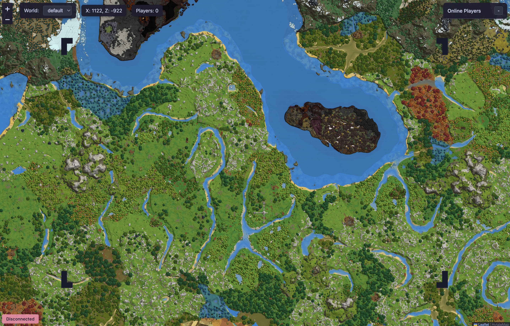

<h2 align="center">🗺️ A dynamic map plugin for Hytale servers</h2>

This plugin brings real-time dynamic mapping to Hytale servers, similar to Dynmap for Minecraft. It provides a web-based interface that allows players to view their server's world in real-time through their browser, with support for player tracking, markers, and more.

⚠️ The project is still in development, so if you encounter any bugs or have any feature requests, please open an issue or a discussion.

 

  <a href="https://github.com/boul2gom/HytaleMap/issues/new?assignees=&labels=bug&template=BUG_REPORT.md&title=bug%3A+">Report a Bug</a>
  ·
  <a href="https://github.com/boul2gom/HytaleMap/discussions/new?assignees=&labels=enhancement&title=feat%3A+">Request a Feature</a>
  ·
  <a href="https://github.com/boul2gom/HytaleMap/discussions/new?assignees=&labels=help%20wanted&title=ask%3A+">Ask a Question</a>

---

  
  

  
  
  

  
  
  

  

---

## 📥 Installation

### Installing the plugin

1. Download the latest release from [GitHub Releases](https://github.com/boul2gom/HytaleMap/releases)
2. Stop your Hytale server
3. Place the downloaded `.jar` file in your server's `Mods` folder
4. Start your server
6. Access the web interface at `http://your-server-ip:8080` (default port)
